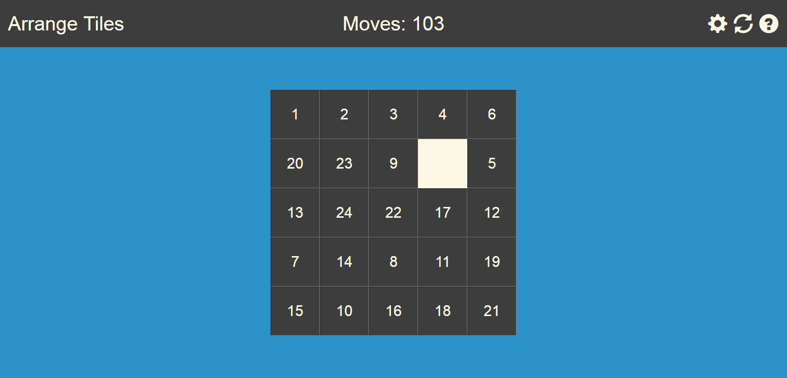
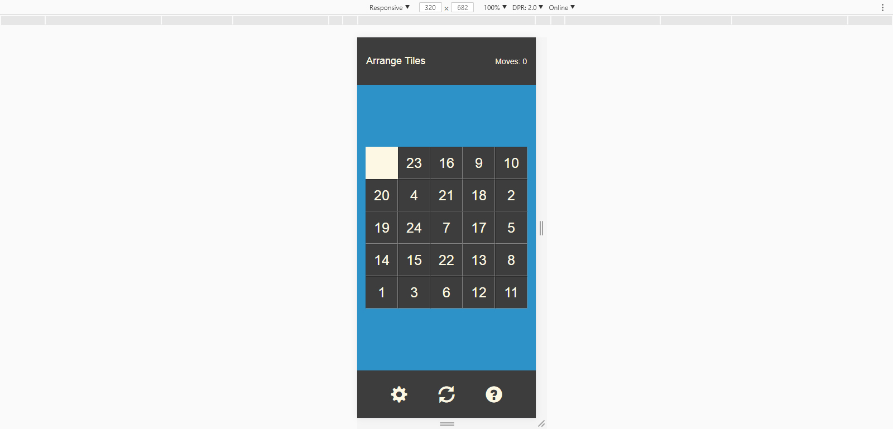

Name: Joseph Morris
Date: 07/12/2016

# Note:
This code has not been edited or maintained since it was written. It serves as an example of my ongoing explorations in coding.

# Description:
This is a mobile-friendly version of a tile-arrangement game. It tracks the user's achievements by recording the number of moves taken as well as how long it took to solve. The grid size can be set within the range of 3x3 to 10x10.
